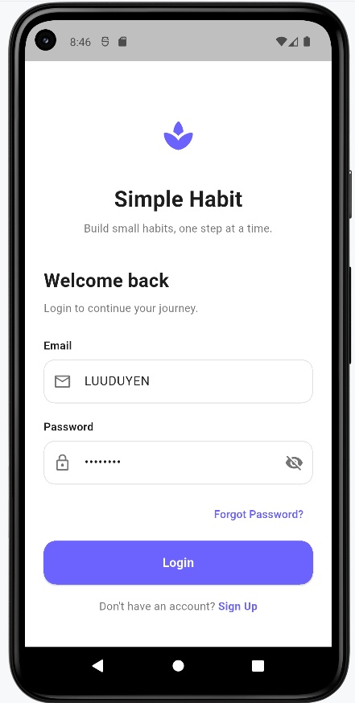
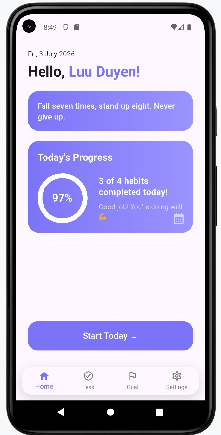
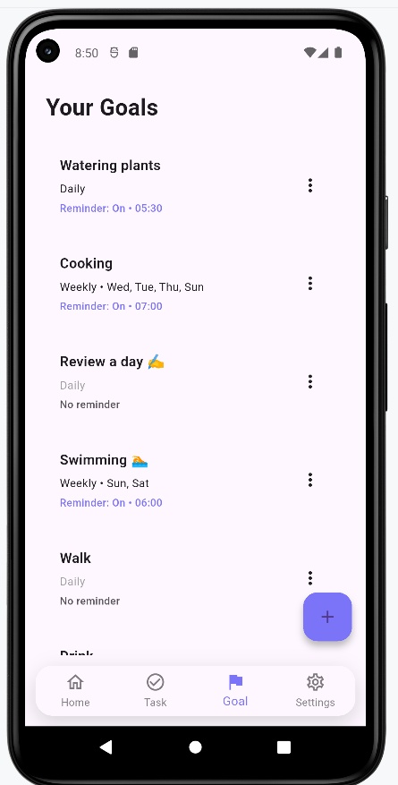
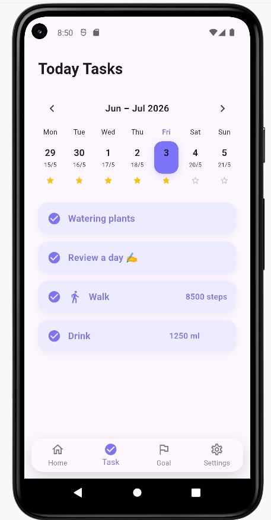
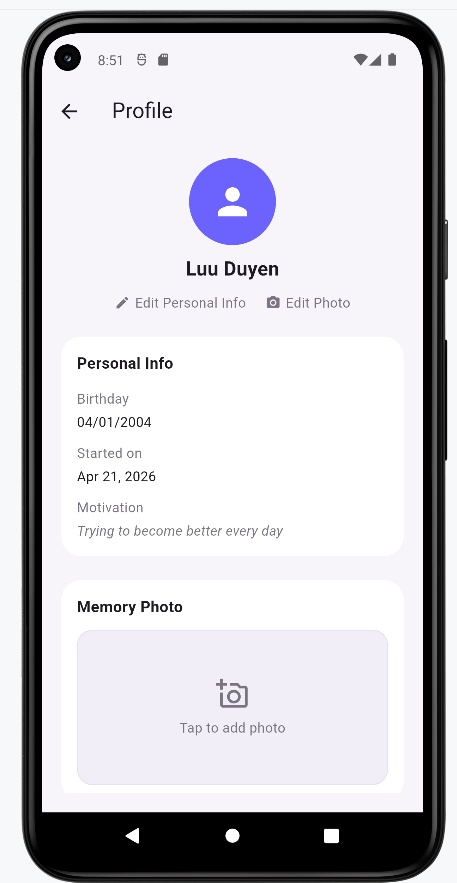
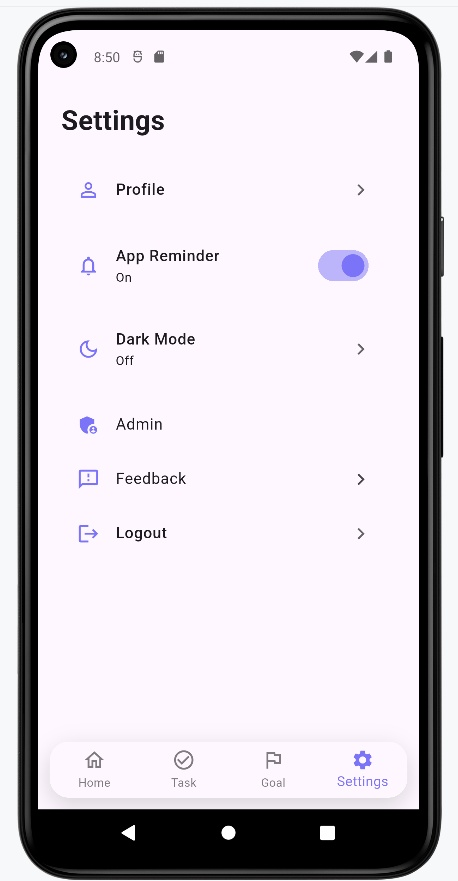
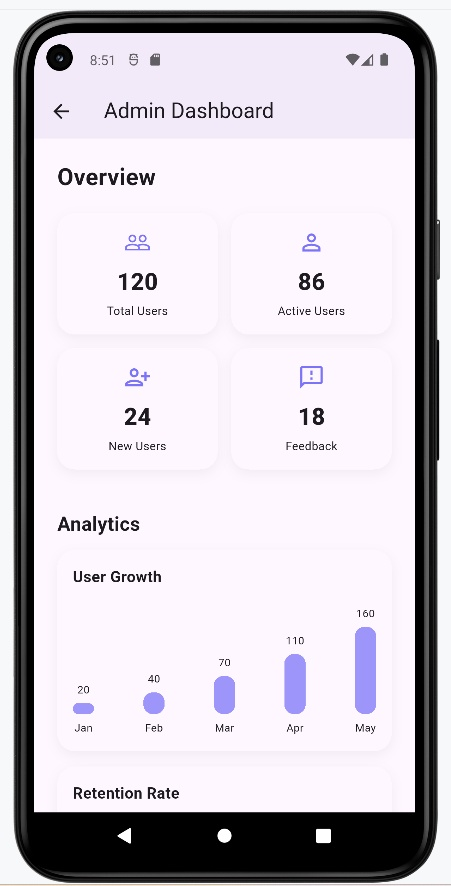
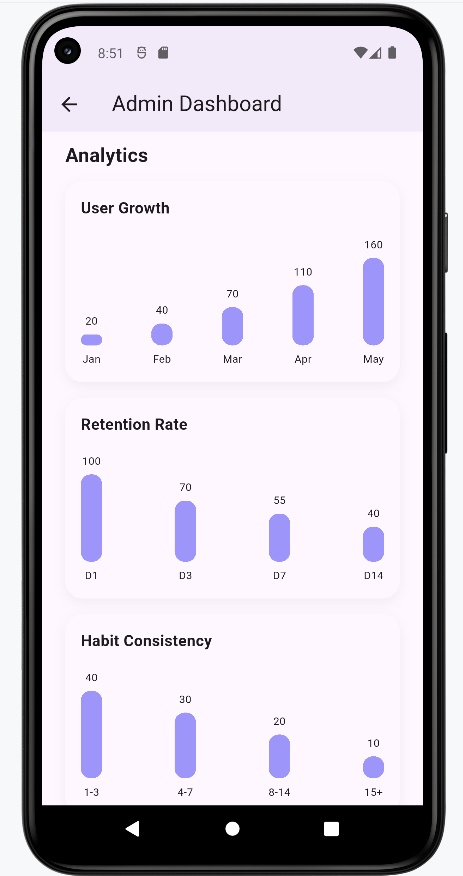

# Simple Habit – Habit Tracking Application

## Introduction

Simple Habit is a mobile application developed using Flutter to support users in building and maintaining positive daily habits.

The application allows users to create goals, manage daily tasks, track progress, and receive reminders to improve personal discipline and productivity.

## Main Features

* User Login & Sign Up
* Goal Management
* Daily Task Tracking
* Reminder Notification
* Progress Tracking
* Profile Management
* Admin Dashboard (Mockup)

## Technologies Used

* Flutter
* Dart
* Android Studio
* SharedPreferences
* flutter_local_notifications
* image_picker
* vnlunar

## Project Structure

```bash
lib/
 ├── screens/
 ├── widgets/
 ├── models/
 ├── services/
 └── main.dart
```

## Installation & Run

1. Install Flutter SDK
2. Open project in Android Studio
3. Run the following commands:

```bash
flutter pub get
flutter run
```

## Author

* Student: Lưu Thị Duyên
* Graduation Thesis:
  “Xây dựng ứng dụng Simple Habit quản lý thói quen người dùng”


## 📸 Giao diện ứng dụng

| Đăng nhập | Trang chủ |
|:---------:|:---------:|
|  |  |

| Quản lý mục tiêu | Quản lý công việc |
|:----------------:|:-----------------:|
|  |  |

| Hồ sơ cá nhân | Cài đặt |
|:-------------:|:-------:|
|  |  |

| Admin Dashboard | Admin Dashboard |
|:---------------:|:---------------:|
|  |  |

---

